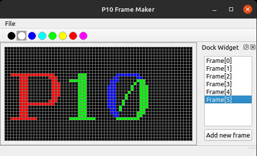

<div align="center">
	<h1>P10 Frame Maker</h1>
	<p>Simple GUI app to generate 3-bit color resource for Full Color P10 RGB LED Display Modules.</p>
</div>


<p align="center">
    </img>
</p>

## Installation

### Ubuntu/Debian build from source code

Install toolchain, make sure `build-essential`, `qt5-default`, `libsfml-dev` were installed. Or install them by:

```console
# apt-get install build-essential qt5-default libsfml-dev
```

Clone the source code:
```console
$ git clone https://github.com/kienvo/p10-frame-maker.git
```

Or clone a release tag:
```console
$ git clone --depth=1 --branch=<tag-name> https://github.com/kienvo/p10-frame-maker.git
```

Then change directory to `p10-frame-maker`
```console
$ cd p10-frame-maker
$ qmake 
$ make
```

If `make` success, a file name `p10-frame-maker.elf` will be created. Execute it by:
```console
./p10-frame-make.elf
```

### Windows

There are [pre-build packages](https://github.com/kienvo/p10-frame-maker/releases) for Windows, built on `Mingw`. Just download it, unzip and run `p10-frame-maker.elf.exe`

## License

This work is published under [LGPLv3](LICENSE.txt) License.